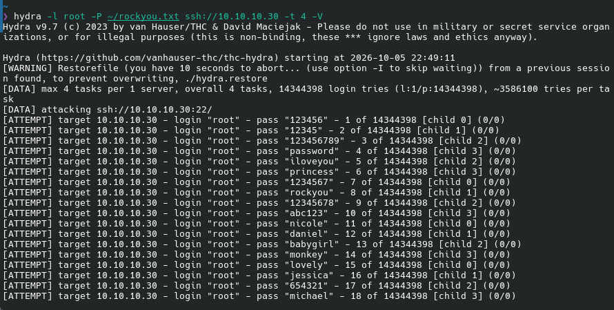
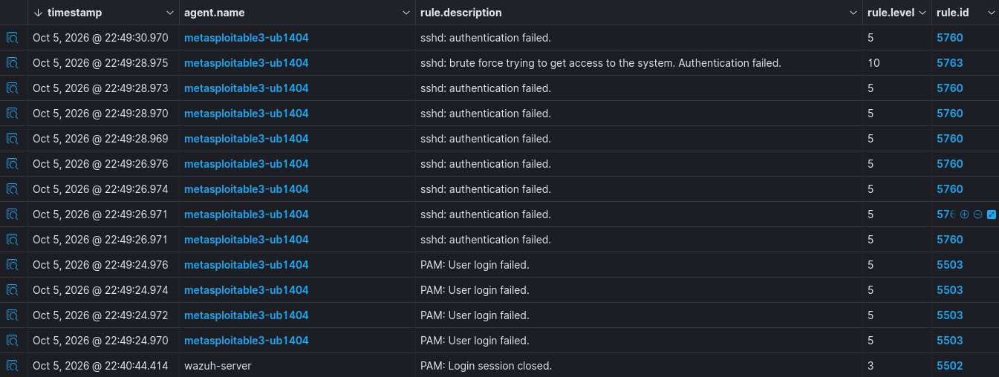
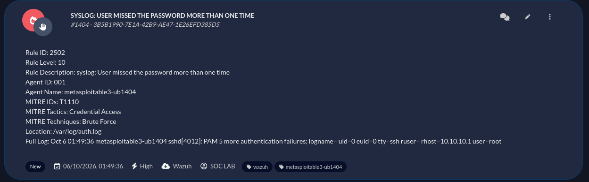

# 🛡️ SOC Automation Lab: Wazuh SIEM to DFIR IRIS Integration

Este repositório contém a documentação técnica, scripts de automação e guia de replicação para um Laboratório Prático de SOC (Security Operations Center).

---

##  Objetivo do Laboratório

Demonstrar o fluxo de detecção e resposta a incidentes *End-to-End*:
1. Simulação de ataque de força bruta SSH via **Hydra**.
2. Coleta e análise de logs do Ubuntu Linux (`/var/log/*.log`) pelo **Wazuh Manager**.
3. Disparo de regras de correlação (Regra `5763`).
4. Automação via API REST para criação de casos na plataforma de gestão de incidentes **DFIR IRIS**.

---

##  Arquitetura do Ambiente

| Ativo / VM | Função | Sistema Operacional |
| :--- | :--- | :--- |
| **Host** | Hypervisor (Virt-Manager/KVM) | CachyOS (Arch Linux) |
| **Target (Vítima)** | Servidor de Testes & Logs | Metasploitable 3 (Ubuntu) |
| **SIEM / XDR** | Análise e Correlação de Regras | Wazuh Manager v4.14.7 |
| **SOAR / Case Mgmt** | Gestão de Incidentes (Docker) | DFIR IRIS |

---

##  Desafios & Soluções Aplicadas

* **Problema:** Condição de corrida no boot do Linux onde o agente Wazuh iniciava antes da interface de rede estar 100% pronta, falhando o registro no servidor.
* **Solução:** Script de inicialização customizado em `/etc/rc.local` validando a conectividade com o gateway antes de subir o serviço `wazuh-agent`.

---

##  Evidências de Funcionamento

1. **Simulação de Ataque:** Disparo usando Hydra contra a porta 22 da vítima.

2. **Detecção no SIEM:** Painel do Wazuh mostrando o alerta da Regra `5763` (SSHD brute force).

3. **Caso Criado no IRIS:** Painel do DFIR IRIS exibindo o incidente criado automaticamente via API.

---
 **Documentação Completa:** Para ver o relatório detalhado de construção e notas de estudo no Notion, [clique aqui](https://app.notion.com/p/Montagem-do-Laborat-rio-Virtual-de-An-lise-de-SOC-0dec1b142f51490b9792e5a041bc614c?source=copy_link).
